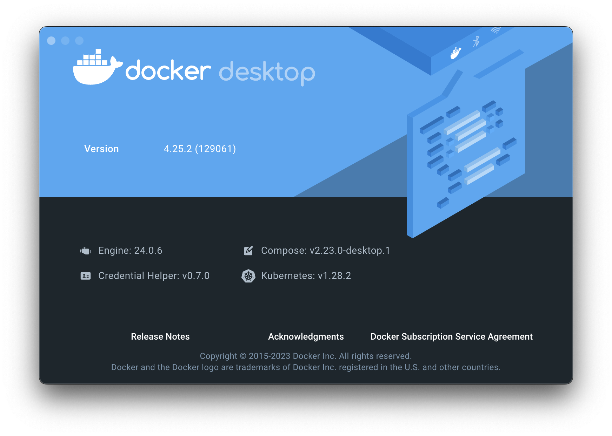

# Utility `devenvctl`

`devenvctl` allows developers to quickly build, start, stop and switch development environments using [Docker](https://www.docker.com/). 

<br>

## Example Use Case:

>   - Project 1 requires MongoDB + ElasticSearch + RabbitMQ + Redis 5.0
>   - Project 2 requires Cassandra + Kafka + Redis 7.0 + Consul
>   - Project 3 requires same stack as Project 2, but requires different initial condition (e.g. different database schema)
>
> I can quickly switch between projects using this utility: 
> 
> ```
> devenvctl stop project_1 
> devenvctl start project_2
> devenvctl restart project_2
> ```

<br>

## Usage

> **Note**: This CLI tool is intended to support MacOS, Linux and Windows, but it's only tested on MacOS. Linux and Windows testers are welcome :)

### Prerequisites

1. `Docker` is required for this utility (2.0.0.0+ recommended). After install, verify that `docker compose` can run properly.

    ```shell
    $ docker compose version
    Docker Compose version v2.23.0-desktop.1
    ```
    
    

2. Make sure `/usr/local/var` is in the list of allowed mounts to bind.
   
   #### For Mac
   Open `Docker Desktop` -> `Settings`. Select `Resources` -> `File Sharing`:

    

3. Optionally, if install from source, minimum GO version is 1.22  

    #### For Mac
    ```shell
    brew install go
    ```

### Install from Source

```shell
go install github.com/stonedu1011/devenvctl@latest
```

### Common Usage 

- To see the help `devenvctl -h` or `devenvctl --help`

- Syntax: `devenvctl <command> <env_name>`, where actions are typically `info`, `start`, `stop` and `restart`. 
    
- E.g. to start pre-defiend "golanai" environment: 

  ```
  devenvctl start golanai
  ```

### Environment Definition

Develop Environment's Definition is also referred as `profile` in this project.

This CLI tool searches for available profiles by finding profile definition file with filename `devenv-<profile-name>.yml`. The search is in following order:

- Pre-defined profiles built into the tool.
- `.devenv` folder in user's home directory. e.g. `~/.devenv` or `$HOME/.devenv`
- Working directory, configurable via `--workspace` flag, default to the current directory
- Directory defined in environment variable `$DEV_ENV_PATH`
- Any additional search paths supplied via `--search-paths` flag.

> **Note**: If any profile is found in multiple places, the later definition would be used. 

#### Create Your Own

> **Note**: Knowledge to GO template, Shell scripting, Docker Compose and Dockerfile syntax is necessary to create your own environment profile.

Each profile is composed by following components:

- A definition file with name `devenv-<profile-name>.yml`, which describe required services, versions, build arguments, hooks, etc.
- A docker compose YAML template with name `docker-compose-<profile-name>.yml`. This template is used to generate final `docker-compose.yml`.
- A folder with name `res-<profile-name>`, which contains all extra files you may need to build your customized docker images.

#### Example 1: [example-v1](examples)

This example demonstrate 
- how to use hooks to run containers or scripts during start/stop
- how to use custom images
- how to use `docker-compose-<name>.yml` as a GO template

[examples](examples)/<br>
|-- [devenv-example-v1.yml](examples/devenv-example-v1.yml)<br>
|-- [docker-compose-example-v1.yml](examples/docker-compose-example-v1.yml)<br>
|-- [res-example-v1](examples/res-example-v1)/<br>
&nbsp;&nbsp;&nbsp;&nbsp;|---- [kafka-wurstmeister](examples/res-example-v1/kafka-wurstmeister)/<br>
&nbsp;&nbsp;&nbsp;&nbsp;&nbsp;&nbsp;&nbsp;&nbsp;|-- files to build custom images<br>
&nbsp;&nbsp;&nbsp;&nbsp;|---- [pre-start](examples/res-example-v1/pre-start)/<br>
&nbsp;&nbsp;&nbsp;&nbsp;&nbsp;&nbsp;&nbsp;&nbsp;|-- scripts to run before `start`<br>
&nbsp;&nbsp;&nbsp;&nbsp;|---- [post-start](examples/res-example-v1/post-start)/<br>
&nbsp;&nbsp;&nbsp;&nbsp;&nbsp;&nbsp;&nbsp;&nbsp;|-- files to build containers that will be run during `start` after services are UP<br>
&nbsp;&nbsp;&nbsp;&nbsp;|---- [pre-stop](examples/res-example-v1/post-start)/<br>
&nbsp;&nbsp;&nbsp;&nbsp;&nbsp;&nbsp;&nbsp;&nbsp;|-- scripts to run before `stop`<br>
&nbsp;&nbsp;&nbsp;&nbsp;|---- [post-stop](examples/res-example-v1/post-start)/<br>
&nbsp;&nbsp;&nbsp;&nbsp;&nbsp;&nbsp;&nbsp;&nbsp;|-- scripts to run after `stop`, before cleanup<br>

#### Example 2: [golanai](pkg/devenv/presets) profile

This is a built-in profile (presets), used for development of microservice framework [go-lanai](https://github.com/cisco-open/go-lanai). 

[presets](pkg/devenv/presets)/<br>
|-- [devenv-golanai.yml](pkg/devenv/presets/devenv-golanai.yml)<br>
|-- [docker-compose-golanai.yml](pkg/devenv/presets/docker-compose-golanai.yml)<br>
|-- [res-golanai](pkg/devenv/presets/res-golanai)/<br>
&nbsp;&nbsp;&nbsp;&nbsp;|-- [cockroachdb](pkg/devenv/presets/res-golanai/cockroachdb)/<br>
&nbsp;&nbsp;&nbsp;&nbsp;&nbsp;&nbsp;&nbsp;&nbsp;|--  ...<br>
&nbsp;&nbsp;&nbsp;&nbsp;|---- [kafka-wurstmeister](pkg/devenv/presets/res-golanai/kafka-wurstmeister)/<br>
&nbsp;&nbsp;&nbsp;&nbsp;&nbsp;&nbsp;&nbsp;&nbsp;|-- ...<br>
&nbsp;&nbsp;&nbsp;&nbsp;|---- [post-start](pkg/devenv/presets/res-golanai/post-start)/<br>
&nbsp;&nbsp;&nbsp;&nbsp;&nbsp;&nbsp;&nbsp;&nbsp;|-- ...<br>

<br>

### Notes:

#### Docker Pruning

This tool always try to perform Docker pruning on containers, volumes and images. 
To preserve data volumes, add a label to the volume defined in "docker compose" config template:

```yaml
volumes:
  my-volume:
    name: "my-volume-name-${PROJECT_NAME}"
    labels:
      "devenv.persist": true
```

#### Containerized Hooks

`post-start` hooks can run containerized scripts as long as they are properly started in "docker compose" config template.
If also defined in the profile definition file, the tool would monitor those containers and wait for them to finish before continue.

<br>